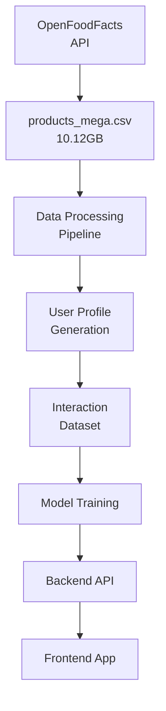

# NutriScore Calculator - Comprehensive Project Documentation

## 1. Project Overview
- **Name**: NutriScore Calculator
- **Purpose**: A personalized health scoring system for food products based on user health profiles and nutritional content
- **Technology Stack**:
  - Backend: Python Flask
  - Frontend: Streamlit
  - Machine Learning: Scikit-learn and RandomForestRegressor
  - Data Processing: Pandas, NumPy
  - Computer Vision: OpenCV, Pyzbar
  - API Integration: Requests

## 2. Data Pipeline and Workflow

### 2.1 Data Acquisition


### 2.2 Data loading and Processing

```python
def load_and_process_data():
    # 1. Set up directories
    data_dir = 'D:/nutrifymeeee/data'
    model_dir = 'D:/nutrifymeeee/model'
    
    # 2. Load large dataset in chunks (100,000 rows at a time)
    chunk_size = 100000
    relevant_data = pd.DataFrame()
    
    # 3. Process each chunk:
    for chunk in pd.read_csv('products_mega.csv', 
                            chunksize=chunk_size,
                            encoding='utf-8',
                            sep='\t'):
        # Filter relevant columns:
        column_map = {
            'code': 'code',  # Barcode
            'product_name': 'product_name',
            'sugars_100g': 'sugars_100g',
            'salt_100g': 'salt_100g',
            'preservatives': 'additives'
        }
        
        # Process and clean data
        filtered_chunk = chunk[list(column_map.values())].dropna()
        filtered_chunk = filtered_chunk.rename(columns=column_map)
        
        # Append to main dataset
        relevant_data = pd.concat([relevant_data, filtered_chunk])
        
        # Stop after 500,000 products
        if len(relevant_data) >= 500000:
            break
```

### 2.3 User Profile Generation

```python
# Generate 1000 synthetic user profiles
num_users = 1000
user_profiles = pd.DataFrame({
    'age': np.random.normal(30, 10, num_users).astype(int),  # Mean age 30
    'weight_kg': np.random.normal(70, 15, num_users).astype(int),  # Mean weight 70kg
    'height_cm': np.random.normal(170, 10, num_users).astype(int),  # Mean height 170cm
    'sugar_level': np.random.normal(90, 15, num_users).astype(int),  # Mean blood sugar 90
    'diabetes': np.random.binomial(1, 0.1, num_users),  # 10% chance of diabetes
    'hypertension': np.random.binomial(1, 0.15, num_users)  # 15% chance of hypertension
})
```

#### 2.4 INTERACTION DATASET 
``` python
# For each user, randomly sample up to 10 products
for _, user in user_profiles.iterrows():
    num_samples = min(10, len(products_df))
    sampled_products = products_df.sample(num_samples, replace=False)
    
    # Calculate health score for each product
    for _, product in sampled_products.iterrows():
        score = 100  # Base score
        
        # Calculate penalties based on nutritional content
        sugar_per_kg = product['sugars_100g'] * 10
        sodium_per_kg = product['salt_1000g'] * 1000 if 'salt_1000g' in product else product['salt_100g'] * 1000
        
        # Apply penalties
        score -= min(30, sugar_per_kg * 2)  # Sugar penalty
        score -= min(20, sodium_per_kg * 0.01)  # Sodium penalty
        score -= 10 if pd.notna(product['preservatives']) else 0  # Preservative penalty
        
        # Condition-specific penalties
        if user['diabetes'] == 1:
            score -= min(20, sugar_per_kg * 1)  # Diabetes penalty
        if user['hypertension'] == 1:
            score -= min(15, sodium_per_kg * 0.005)  # Hypertension penalty
        
        # Clamp score between 0 and 100
        score = max(0, min(100, score))
```


##### 2.5 MODEL TRAINING
``` python
def train_model(train_df, test_df):
    # Define features to use
    features = [
        "age", "weight", "height", "sugar_level", "diabetes", "hypertension",
        "sugar", "sodium", "sugar_per_kg", "sodium_per_kg", "preservative_count"
    ]
    
    # Split data into features and target
    X_train = train_df[features]
    y_train = train_df["health_score"]
    
    # Set up Random Forest model with GridSearchCV
    param_grid = {
        'n_estimators': [200, 300, 400, 500],  # Number of trees
        'max_depth': [None, 20, 30, 40, 50],  # Maximum depth of trees
        'min_samples_split': [2, 5, 10, 15],  # Minimum samples required to split
        'min_samples_leaf': [1, 2, 4, 6],  # Minimum samples required at leaf node
        'max_features': ['auto', 'sqrt', 'log2']  # Number of features to consider
    }
    
    # Create and train model
    rf = RandomForestRegressor(random_state=42)
    grid_search = GridSearchCV(
        estimator=rf,
        param_grid=param_grid,
        cv=5,  # 5-fold cross-validation
        n_jobs=-1,  # Use all available CPU cores
        verbose=2,  # Show progress
        scoring='r2'  # Use R² score for evaluation
    )
    
    # Train the model
    grid_search.fit(X_train, y_train)
```


###### 2.6 MODEL EVALUATION
```python
# Evaluate on training data
y_train_pred = best_model.predict(X_train)
train_r2 = r2_score(y_train, y_train_pred)
train_mse = mean_squared_error(y_train, y_train_pred)
train_mae = mean_absolute_error(y_train, y_train_pred)

# Evaluate on test data
y_test_pred = best_model.predict(X_test)
test_r2 = r2_score(y_test, y_test_pred)
test_mse = mean_squared_error(y_test, y_test_pred)
test_mae = mean_absolute_error(y_test, y_test_pred)

# Print results
print("\nTraining Set Performance:")
print(f"R2 Score: {train_r2:.4f}")
print(f"Mean Squared Error: {train_mse:.4f}")
print(f"Mean Absolute Error: {train_mae:.4f}")
print(f"Training Accuracy: {100 * (1 - train_mae / 100):.2f}%")

print("\nTest Set Performance:")
print(f"R2 Score: {test_r2:.4f}")
print(f"Mean Squared Error: {test_mse:.4f}")
print(f"Mean Absolute Error: {test_mae:.4f}")
print(f"Test Accuracy: {100 * (1 - test_mae / 100):.2f}%")
```
